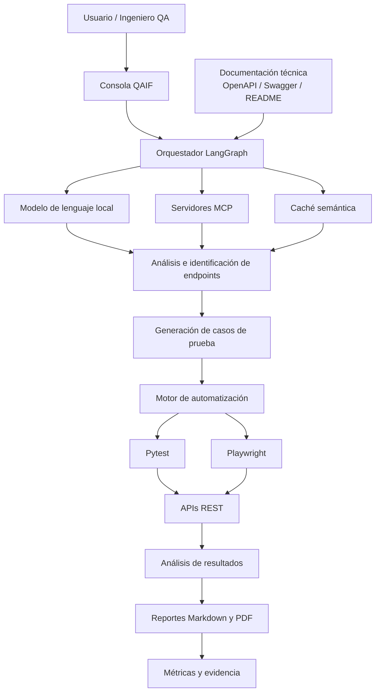
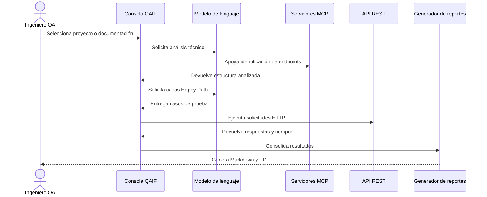

<div align="center">

# QAIF

### Quality Assurance with Artificial Intelligence for Fintech

Framework para la automatización inteligente de pruebas sobre APIs REST en organizaciones fintech colombianas.

<br>


**Proyecto de grado — Ingeniería de Sistemas**  
**Universidad Nacional Abierta y a Distancia (UNAD)**

</div>

---

## Contenido

- [Descripción](#descripción)
- [Problema que aborda](#problema-que-aborda)
- [Objetivo general](#objetivo-general)
- [Objetivos específicos](#objetivos-específicos)
- [Arquitectura general](#arquitectura-general)
- [Aporte de la inteligencia artificial](#aporte-de-la-inteligencia-artificial)
- [Funcionalidades implementadas](#funcionalidades-implementadas)
- [Escenarios de validación](#escenarios-de-validación)
- [Tecnologías utilizadas](#tecnologías-utilizadas)
- [Requisitos previos](#requisitos-previos)
- [Configuración y ejecución](#configuración-y-ejecución)
- [Flujo de funcionamiento](#flujo-de-funcionamiento)
- [Resultados de la demostración](#resultados-de-la-demostración)
- [Trazabilidad del proyecto](#trazabilidad-del-proyecto)
- [Estructura del repositorio](#estructura-del-repositorio)
- [Evidencias](#evidencias)
- [Alcance académico](#alcance-académico)
- [Autores](#autores)
- [Estado del proyecto](#estado-del-proyecto)

---

## Descripción

QAIF (Quality Assurance with Artificial Intelligence for Fintech) es un framework orientado a fortalecer el aseguramiento de la calidad del software mediante la automatización inteligente de pruebas sobre APIs REST en organizaciones fintech colombianas.

La solución integra inteligencia artificial, automatización de pruebas y buenas prácticas de ingeniería de software para apoyar el análisis de documentación técnica, la identificación de endpoints, la generación de casos de prueba, la ejecución automatizada, el análisis de resultados y la generación de reportes técnicos.

El prototipo fue concebido para validarse en un entorno académico y controlado, utilizando APIs simuladas, datos sintéticos y documentación técnica disponible para pruebas.

---

## Problema que aborda

Las organizaciones fintech trabajan con servicios digitales que requieren altos niveles de confiabilidad, seguridad y disponibilidad. Sin embargo, los procesos de validación de APIs REST suelen apoyarse en actividades manuales o parcialmente automatizadas, lo que incrementa el esfuerzo operativo, reduce la cobertura de pruebas y dificulta la detección temprana de defectos.

QAIF propone una estructura metodológica y tecnológica que articula inteligencia artificial, automatización y trazabilidad para apoyar al ingeniero QA durante las etapas iniciales de análisis, diseño, ejecución y documentación de pruebas.

---

## Objetivo general

Diseñar e implementar un framework de automatización de pruebas asistido por inteligencia artificial para APIs REST en entornos fintech colombianos, mediante el análisis comparativo de herramientas de inteligencia artificial aplicadas al aseguramiento de la calidad del software, con el propósito de fortalecer la eficiencia, la cobertura y la confiabilidad de los procesos de validación.

---

## Objetivos específicos

1. Identificar herramientas de inteligencia artificial aplicables al aseguramiento de la calidad del software.
2. Evaluar su pertinencia mediante criterios técnicos, funcionales y de integración.
3. Diseñar la arquitectura del framework QAIF para la generación, ejecución y análisis de pruebas.
4. Implementar un prototipo funcional en escenarios demostrativos basados en APIs REST.
5. Validar su funcionamiento mediante indicadores de ejecución, cobertura y detección de defectos.

---

## Arquitectura general



La arquitectura separa el análisis, la generación de pruebas, la ejecución y la producción de evidencia. Esta organización facilita la trazabilidad del proceso y permite que cada componente sea comprendido y validado de manera independiente.

---

## Aporte de la inteligencia artificial

La inteligencia artificial actúa como mecanismo de apoyo al ingeniero QA. Dentro del prototipo participa en las siguientes actividades:

- Interpretación de documentación técnica y archivos README.
- Identificación de endpoints, métodos HTTP y parámetros relevantes.
- Generación asistida de casos de prueba Happy Path.
- Organización de escenarios y criterios de validación.
- Apoyo al análisis de resultados obtenidos.
- Consolidación de información para reportes técnicos.

El framework no reemplaza el criterio profesional del evaluador. Su función es reducir tareas repetitivas, mejorar la trazabilidad y acelerar la preparación inicial de las pruebas.

---

## Funcionalidades implementadas

- Análisis automático de documentación técnica.
- Identificación de endpoints y métodos HTTP.
- Generación asistida de casos de prueba Happy Path.
- Ejecución automatizada de pruebas funcionales sobre APIs REST.
- Registro de URL, método, código de respuesta, tiempo de ejecución y estado PASS o FAIL.
- Validación de respuestas y códigos de estado.
- Análisis automatizado de resultados.
- Generación de reportes técnicos en Markdown y PDF.
- Conservación de evidencia para la revisión posterior.
- Ejecución en entornos controlados mediante datos sintéticos.

---

## Escenarios de validación

El prototipo se orienta a escenarios representativos del sector fintech:

- Autenticación de usuarios.
- Consulta de saldo.
- Transferencia de fondos.

La validación se realiza exclusivamente mediante APIs simuladas, entornos sandbox y datos de prueba. No se utilizan datos financieros reales ni se intervienen sistemas productivos de entidades financieras.

---

## Tecnologías utilizadas

| Tecnología | Uso dentro del proyecto |
|---|---|
| Python 3.12 | Desarrollo del framework y procesamiento de información |
| pytest | Ejecución y validación de casos de prueba |
| Playwright | Automatización y apoyo a la ejecución de pruebas |
| LangGraph | Orquestación del flujo del agente |
| Model Context Protocol (MCP) | Integración de componentes especializados |
| Ollama | Ejecución local del modelo de lenguaje |
| Qwen | Modelo local empleado en la demostración |
| OpenAPI / Swagger | Fuente de documentación y contratos de APIs REST |
| Pydantic | Validación y estructuración de datos |
| Redis | Almacenamiento temporal y apoyo a la caché |
| Git y GitHub | Control de versiones, trazabilidad y publicación del código |
| Markdown y PDF | Generación de reportes técnicos |

> La documentación maestra también contempla Docker, Docker Compose y GitHub Actions como tecnologías de soporte para reproducibilidad e integración continua. La incorporación definitiva de estos elementos debe mantenerse coherente con los archivos efectivamente disponibles en el repositorio.

---

## Requisitos previos

Antes de ejecutar el prototipo se recomienda contar con:

- Git instalado.
- Python 3.12 o superior.
- `uv` como gestor de dependencias.
- Ollama instalado y en ejecución.
- El modelo local `qwen3:8b` disponible en Ollama.
- Redis disponible cuando el flujo requiera caché o almacenamiento temporal.
- Una API REST o proyecto de prueba con documentación técnica accesible.

---

## Configuración y ejecución

### 1. Clonar el repositorio

```bash
git clone https://github.com/miguelvillabon07/QAIF.git
cd QAIF
```

### 2. Instalar dependencias

```bash
uv sync
```

### 3. Verificar la configuración local

El archivo `.env` contiene parámetros de configuración del entorno, entre ellos:

```env
PROVEEDOR_DE_LLM=local
NOMBRE_DE_MODELO_LOCAL=qwen3:8b
OLLAMA_BASE_URL=http://mcp-ollama:11434/v1
REDIS_URL=redis://mcp-redis:6379
REVISION_HUMANA_ACTIVADA=FALSO
NIVEL_DE_REGISTRO=DEPURAR
```

Estos valores pueden ajustarse según el entorno de ejecución. No deben incorporarse credenciales, claves privadas ni información sensible.

### 4. Ejecutar el agente

El prototipo se ejecuta desde la consola del proyecto utilizando los módulos disponibles en `src/` y los scripts incluidos en el repositorio. La secuencia funcional demostrada comprende:

1. Selección o análisis del proyecto objetivo.
2. Lectura de la documentación técnica.
3. Identificación de endpoints.
4. Generación de casos Happy Path.
5. Ejecución automática de las pruebas.
6. Consolidación de resultados.
7. Generación de reportes Markdown y PDF.

> Debido a que el comando exacto puede variar según el módulo o script utilizado en la demostración, se recomienda consultar la carpeta `scripts/` y la documentación técnica incluida en `docs/` antes de ejecutar el prototipo.

---

## Flujo de funcionamiento



---

## Resultados de la demostración

Durante la demostración del prototipo se ejecutaron siete pruebas correspondientes al flujo Happy Path.

- Total de pruebas ejecutadas: **7**.
- Pruebas finalizadas correctamente: **2**.
- Pruebas con respuesta HTTP 404: **5**.
- Reportes generados: **Markdown y PDF**.

Las respuestas 404 no representan un fallo del framework. Corresponden al comportamiento del proyecto evaluado, debido a que algunos endpoints requieren recursos creados previamente o identificadores válidos antes de ejecutar determinadas operaciones.

Para cada solicitud, QAIF registra:

- Método HTTP.
- URL evaluada.
- Código de respuesta.
- Tiempo de ejecución.
- Estado PASS o FAIL.

---

## Trazabilidad del proyecto

| Objetivo del proyecto | Evidencia en el prototipo | Evidencia en el repositorio |
|---|---|---|
| Identificar tecnologías aplicables al QA con IA | Selección del modelo local y herramientas de automatización | Documentación técnica y configuración |
| Evaluar herramientas y criterios de integración | Integración de LLM, MCP, pytest y Playwright | Arquitectura, código fuente y estructura modular |
| Diseñar la arquitectura de QAIF | Flujo de análisis, generación, ejecución y reporte | Diagramas Mermaid y módulos en `src/` |
| Implementar el prototipo funcional | Ejecución demostrada sobre APIs REST | Código fuente, scripts y pruebas |
| Validar el funcionamiento | Resultados PASS/FAIL, tiempos y códigos HTTP | Reportes, video y evidencia técnica |

Esta relación busca mantener coherencia entre los objetivos específicos, las historias de usuario, las funcionalidades implementadas y las evidencias presentadas.

---

## Estructura del repositorio

```text
QAIF/
├── config/                    # Configuración general
├── docs/                      # Documentación técnica
├── mcp_servers/               # Servidores MCP especializados
├── scripts/                   # Scripts auxiliares
├── src/                       # Código fuente del framework
│   ├── cache/                 # Gestión de caché
│   ├── console/               # Interfaz de consola
│   ├── llm/                   # Integración con modelos de lenguaje
│   ├── orchestrator/          # Orquestación del flujo
│   ├── schemas/               # Modelos y esquemas de datos
│   └── utils/                 # Funciones auxiliares
├── tests/                     # Pruebas unitarias y de integración
├── workspace/                 # Datos de prueba, registros y reportes
├── .env                       # Configuración local sin credenciales
├── POS_API_Collection.json    # Colección utilizada en la validación
├── pyproject.toml             # Dependencias y configuración del proyecto
├── uv.lock                    # Bloqueo de dependencias
└── README.md                  # Documentación principal
```

---

## Evidencias

### Video demostrativo

[Ver demostración del prototipo funcional en YouTube](https://youtu.be/fBCzXiYRcgg?si=q_tsTtbEC8QkuFle)

### Repositorio

[Acceder al repositorio público de QAIF](https://github.com/miguelvillabon07/QAIF)

El video evidencia el análisis de documentación, la identificación de endpoints, la generación de pruebas Happy Path, la ejecución automática y la creación de reportes técnicos.

---

## Alcance académico

QAIF se desarrolla con fines académicos y de investigación. El prototipo:

- No se implementa en ambientes productivos de entidades financieras.
- No procesa datos reales de clientes.
- No ejecuta transacciones financieras reales.
- No entrena modelos propios de inteligencia artificial desde cero.
- Se valida mediante APIs simuladas, datos sintéticos y entornos controlados.

---

## Autores

- **Miguel Ángel Villabón Romero**
- **Diana Carolina Herrera Ayala**

**Programa de Ingeniería de Sistemas**  
**Universidad Nacional Abierta y a Distancia (UNAD)**

---

## Estado del proyecto

El repositorio corresponde al desarrollo del framework **QAIF (Quality Assurance with Artificial Intelligence for Fintech)** como parte del proyecto de grado del programa de Ingeniería de Sistemas de la Universidad Nacional Abierta y a Distancia.

El prototipo funcional se encuentra en proceso de revisión y mejora conforme a la metodología CDIO/Scrum, las historias de usuario definidas, las observaciones de la fase anterior y la retroalimentación del director del curso.

Su finalidad es demostrar la viabilidad de una propuesta de automatización inteligente de pruebas sobre APIs REST mediante inteligencia artificial en un entorno controlado con nivel de maduración tecnológica TRL 5.
