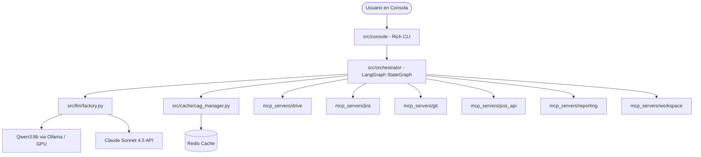

# 🤖 MCP QA Automation — mcp-qa

MCP QA Automation es un sistema inteligente y modular para la automatización de pruebas y control de calidad (QA). Utiliza el estándar **Model Context Protocol (MCP)** de Anthropic y orquestación con **LangGraph** para automatizar el ciclo de vida de QA de extremo a extremo: desde la ingesta de transcripciones de reuniones de planificación hasta la ejecución de pruebas API y el registro estructurado en Jira.

---

## 🏛️ Arquitectura del Sistema

El sistema sigue un diseño híbrido y modular que conecta un agente inteligente central con múltiples servidores MCP especializados y recursos locales.

### Diagrama de Componentes



### Flujo del Pipeline (LangGraph)
El flujo del agente central está construido como un grafo de estados dirigido y condicional con tolerancia a fallos:

1. **`extract_stories` (Drive MCP + LLM)**: Descarga transcripciones de reuniones y extrae Historias de Usuario con criterios de aceptación Gherkin.
2. **`create_jira` (Jira MCP)**: Crea y registra los tickets correspondientes en Jira Cloud. Soporta flujos interactivos de aprobación/revisión por parte de un humano.
3. **`run_api_tests` (POS API + Git MCP)**: Clona el código de la API bajo pruebas, analiza la documentación local (README) para identificar los endpoints, levanta el entorno de la API de forma local y ejecuta dinámicamente pruebas funcionales Happy Path. En caso de fallas de red, aplica reintentos automáticos (hasta 3).
4. **`upload_report` (Reporting MCP)**: Consolida los resultados en reportes Markdown y PDF estilizados y los adjunta directamente a los tickets creados en Jira.

### Decisiones de Diseño Clave
* **Arquitectura de Servidores MCP Custom**: Cada conector a servicios externos (Jira, Google Drive, Git, etc.) está implementado como un servidor MCP independiente que expone herramientas tipadas de manera aislada (con su propio `requirements.txt`).
* **Enfoque Git-First para Testing**: En lugar de depender de documentación externa propensa a estar desactualizada, el agente usa el repositorio Git de la API bajo pruebas como única fuente de verdad, extrayendo endpoints y comandos de inicio directamente del código y de su README.
* **Ejecución Híbrida (Agente en Docker, API en Host)**: Para mantener el agente ligero y evitar problemas de dependencias pesadas (SDKs de Java, Node, Go), el agente Docker dispara las pruebas HTTP hacia la máquina anfitriona (`host.docker.internal`), donde la API bajo prueba se ejecuta localmente.
* **Caché Semántica (CAG)**: Integra una base de datos Redis como caché semántica para reducir hasta un 35% el consumo de tokens y optimizar los tiempos de respuesta del LLM local o en la nube.

---

## 📁 Estructura del Proyecto

```text
mcp-qa/
├── config/                  # Configuración centralizada del sistema (.env)
├── docs/                    # Documentación complementaria y guías de credenciales
├── mcp_servers/             # Servidores MCP independientes y especializados
│   ├── drive/               # Integración con Google Drive para descarga de archivos
│   ├── git/                 # Control de repositorios locales y análisis de READMEs
│   ├── jira/                # Automatización de tareas e incidencias en Jira Cloud
│   ├── pos_api/             # Orquestador local de APIs y ejecución de pruebas HTTP
│   ├── reporting/           # Generación de reportes estilizados en MD/HTML y PDF
│   └── workspace/           # Utilidades compartidas para manejo de archivos locales y logs
├── src/                     # Código fuente de la consola y la lógica del Agente
│   ├── cache/               # Gestor de caché semántica con Redis
│   ├── console/             # Interfaz CLI interactiva avanzada con Rich
│   ├── llm/                 # Fábrica de clientes LLM (Ollama local / Claude API)
│   ├── orchestrator/        # Lógica de LangGraph (Grafo de estados y nodos del pipeline)
│   ├── schemas/             # Definición de esquemas de datos estructurados con Pydantic
│   └── utils/               # Utilidades generales (logs estructurados, reintentos)
└── tests/                   # Suite de pruebas unitarias y de integración
```

---

## ⚙️ Funciones Clave por Componente

### Servidores MCP (`mcp_servers/`)
* **Drive (`drive`)**:
  * `drive_list_files`: Lista archivos de la carpeta de planificación configurada.
  * `drive_read_file`: Descarga y extrae el contenido de texto (transcripciones) para su análisis.
* **Git (`git`)**:
  * `git_clone`: Clona repositorios Git externos para analizar el código localmente.
  * `git_analyze_readme`: Analiza el README con LLM para deducir endpoints y comandos de ejecución.
  * `git_get_info`: Obtiene el estado actual, rama y metadata de los commits del repositorio.
* **Jira (`jira`)**:
  * `jira_create_issue`: Registra Historias de Usuario con prioridades, descripciones y criterios de aceptación.
  * `jira_upload_attachment`: Adjunta archivos y reportes en formato base64 directamente al ticket de Jira.
* **POS API (`pos_api`)**:
  * `pos_api_setup`: Prepara el entorno y detecta la cantidad de endpoints a probar.
  * `pos_api_run_happy_path`: Ejecuta peticiones HTTP asíncronas y valida el comportamiento frente a los esquemas esperados.
  * `pos_api_shutdown`: Finaliza de forma segura la API levantada en segundo plano.
* **Reporting (`reporting`)**:
  * `reporting_generate_md`: Compila los resultados estructurados del test suite en un reporte Markdown limpio.
  * `reporting_generate_pdf`: Genera un documento PDF formal y corporativo usando `reportlab`.
* **Workspace (`workspace`)**:
  * `workspace_list_repos` / `workspace_list_reports`: Permite la exploración y auditoría del sistema de archivos local del agente.

---

## 🛠️ Versionamiento de Librerías

El proyecto está diseñado bajo **Python >= 3.12** utilizando **uv** como gestor de paquetes. A continuación se listan las dependencias principales definidas en [pyproject.toml](file:///C:/projects/quind/mcp-qa/pyproject.toml):

| Categoría | Librería | Versión Requerida | Propósito y Descripción |
|---|---|---|---|
| **AI & Orquestación** | `anthropic` | `>=0.40.0` | Cliente oficial para la API de modelos Claude. |
| | `mcp` | `>=1.3.0` | SDK oficial para la integración del Model Context Protocol. |
| | `langgraph` | `>=0.2.0` | Orquestación estructurada de grafos y estados para el pipeline de QA. |
| | `langchain-core` | `>=0.3.0` | Definición de abstracciones, prompts y herramientas para LLMs. |
| | `langchain-mcp-adapters` | `>=0.1.0` | Adaptadores para exponer herramientas MCP a agentes LangChain. |
| **Validación de Datos** | `pydantic` | `>=2.5.0` | Definición de modelos de datos e intercambio tipado estricto. |
| | `pydantic-settings` | `>=2.0.0` | Carga segura y validada de configuraciones desde el archivo `.env`. |
| **Integraciones** | `google-api-python-client` | `>=2.0.0` | Acceso a las APIs de Google Drive y autenticación. |
| | `atlassian-python-api` | `>=3.41.0` | Cliente oficial para la gestión automática de issues en Jira Cloud. |
| | `gitpython` | `>=3.1.0` | Automatización de tareas de control de versiones locales. |
| **Pruebas y Red** | `httpx` | `>=0.27.0` | Cliente HTTP asíncrono para interactuar con las APIs bajo pruebas. |
| | `redis` | `>=5.0.0` | Conector para la gestión de la caché semántica (CAG). |
| **Reportes y CLI** | `reportlab` | `>=4.0.0` | Motor de generación de reportes y documentos PDF con estilos personalizados. |
| | `Jinja2` | `>=3.1.0` | Renderizado dinámico de plantillas para reportes HTML y MD. |
| | `rich` | `>=13.0.0` | Visualización y formateo enriquecido en la interfaz de consola interactiva. |
| **Desarrollo (Dev)** | `pytest` | `>=8.0.0` | Framework para la ejecución de pruebas unitarias y de integración. |
| | `pytest-asyncio` | `>=0.23.0` | Soporte nativo de asincronía en pytest. |
| | `ruff` | `>=0.3.0` | Linter y formateador de código ultra rápido para Python. |

---

## 🚀 Instalación y Uso Rápido

1. **Clonar e instalar dependencias con uv:**
   ```bash
   # Sincronizar el entorno virtual y dependencias
   uv sync
   ```

2. **Configurar el entorno:**
   Copia el archivo [.env.example](file:///.env.example) a `.env` y completa tus credenciales para los flujos requeridos (Jira, Google Drive, Anthropic, etc.).

3. **Iniciar servicios auxiliares (Redis + Ollama):**
   ```bash
   docker compose up -d
   ```

4. **Ejecutar la consola interactiva:**
   ```bash
   uv run python -m src.console
   ```
   *Una vez iniciada la consola, puedes interactuar con comandos en lenguaje natural como:* `"Analiza el README del repositorio local y ejecuta sus pruebas"`.
