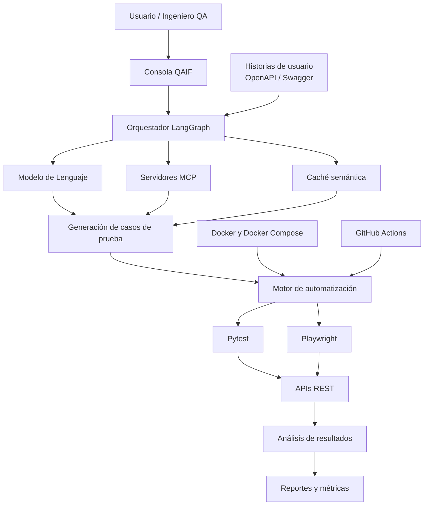

<div align="center">

# QAIF

### Quality Assurance with Artificial Intelligence for Fintech

Framework para la automatización inteligente de pruebas sobre APIs REST en organizaciones fintech colombianas.

<br>


**Proyecto de grado — Ingeniería de Sistemas**  
**Universidad Nacional Abierta y a Distancia (UNAD)**

</div>

---

# Descripción

QAIF (Quality Assurance with Artificial Intelligence for Fintech) es un framework orientado a la automatización inteligente de pruebas sobre APIs REST en organizaciones fintech colombianas.

El proyecto integra inteligencia artificial, automatización de pruebas y buenas prácticas de aseguramiento de la calidad del software para apoyar la generación de casos de prueba, la ejecución automatizada, el análisis de resultados y la generación de reportes técnicos.

El framework se desarrolla como parte del proyecto de grado del programa de Ingeniería de Sistemas de la Universidad Nacional Abierta y a Distancia (UNAD).

---

# Arquitectura general



---

# Objetivo general

Diseñar e implementar un framework de automatización de pruebas asistido por inteligencia artificial para APIs REST en entornos fintech colombianos, mediante el análisis comparativo de herramientas de inteligencia artificial aplicadas al aseguramiento de la calidad del software.

---

# Funcionalidades principales

- Generación asistida de casos de prueba.
- Ejecución automatizada de pruebas funcionales sobre APIs REST.
- Validación de respuestas, códigos de estado y esquemas de datos.
- Análisis automatizado de resultados.
- Generación de reportes de ejecución.
- Integración con modelos de lenguaje.
- Gestión de trazabilidad y evidencia de pruebas.
- Ejecución en entornos controlados mediante datos sintéticos.

---

# Escenarios de validación

El prototipo se orienta a escenarios representativos del sector fintech:

- Autenticación de usuarios.
- Consulta de saldo.
- Transferencia de fondos.

La validación del framework se realiza exclusivamente en entornos académicos, APIs simuladas, entornos Sandbox y datos sintéticos, sin utilizar información financiera real ni intervenir sistemas productivos de entidades financieras.

---

# Componentes del framework

El framework QAIF está conformado por los siguientes componentes principales:

1. **Entrada de requisitos y documentación**, encargada de recibir historias de usuario, especificaciones técnicas y documentación de APIs REST.
2. **Procesamiento con inteligencia artificial**, responsable del análisis de requisitos y la generación de escenarios de prueba.
3. **Gestión de casos de prueba**, donde se estructuran entradas, salidas esperadas y criterios de validación.
4. **Motor de automatización**, encargado de ejecutar las pruebas funcionales sobre los servicios REST.
5. **Análisis de resultados**, que identifica errores, inconsistencias y resultados obtenidos.
6. **Generación de reportes**, para documentar la evidencia y las métricas obtenidas durante la ejecución.
7. **Contenedores e integración continua**, orientados a facilitar la reproducibilidad del entorno y la automatización del proceso de pruebas.

---

# Tecnologías utilizadas

- Python
- Pytest
- Playwright
- Model Context Protocol (MCP)
- LangGraph
- Modelos de Lenguaje (LLM)
- Ollama
- Docker
- Docker Compose
- Git
- GitHub
- GitHub Actions
- OpenAPI / Swagger
- Pydantic
- Redis

---

# Estructura del proyecto

```text
QAIF/
├── config/                 # Configuración general
├── docs/                   # Documentación técnica
├── mcp_servers/            # Servidores MCP especializados
├── scripts/                # Scripts auxiliares
├── src/                    # Código fuente
│   ├── cache/
│   ├── console/
│   ├── llm/
│   ├── orchestrator/
│   ├── schemas/
│   └── utils/
├── tests/                  # Pruebas unitarias e integración
├── workspace/              # Datos de prueba y reportes
├── .env.example
├── Dockerfile
├── docker-compose.yml
├── pyproject.toml
└── README.md
```

---

# Autores

- **Miguel Ángel Villabón Romero**
- **Diana Carolina Herrera Ayala**

**Programa de Ingeniería de Sistemas**  
**Universidad Nacional Abierta y a Distancia (UNAD)**

---

## Estado del proyecto

Este repositorio corresponde al desarrollo del framework **QAIF (Quality Assurance with Artificial Intelligence for Fintech)** como parte del proyecto de grado del programa de Ingeniería de Sistemas de la Universidad Nacional Abierta y a Distancia (UNAD).

El prototipo se encuentra en desarrollo conforme a las actividades definidas para el proyecto y tiene fines exclusivamente académicos y de investigación. Su objetivo es validar una propuesta de automatización inteligente de pruebas sobre APIs REST mediante inteligencia artificial en un entorno controlado.

---

