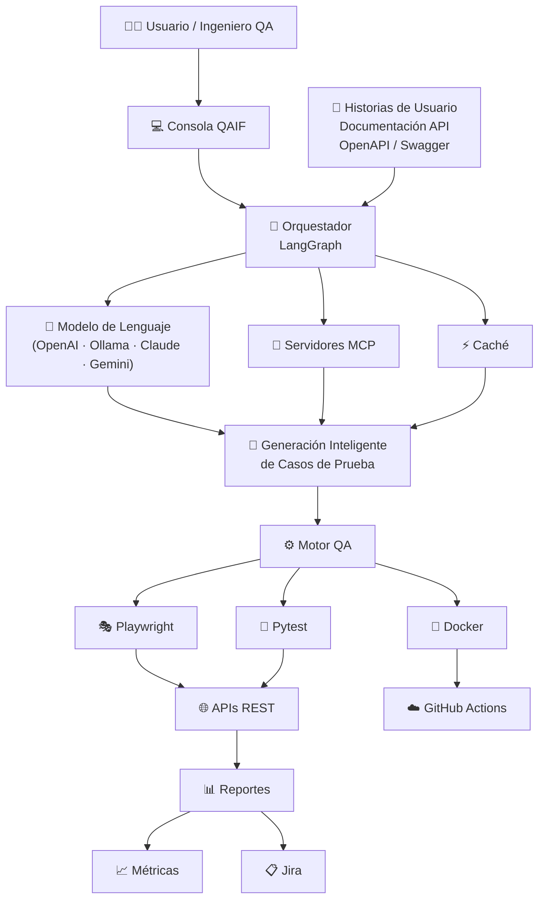

# QAIF – Quality Assurance with Artificial Intelligence for Fintech

## Autores

- Miguel Ángel Villabón Romero
- Diana Carolina Herrera Ayala

Proyecto de grado – Ingeniería de Sistemas

Universidad Nacional Abierta y a Distancia – UNAD

## Descripción

QAIF es un framework orientado a la automatización inteligente de pruebas sobre APIs REST en organizaciones fintech colombianas.

El proyecto integra inteligencia artificial, automatización de pruebas y buenas prácticas de aseguramiento de la calidad del software para apoyar la generación de casos de prueba, la ejecución automatizada, el análisis de resultados y la elaboración de reportes.

El framework se desarrolla como parte de un proyecto de grado del programa de Ingeniería de Sistemas de la Universidad Nacional Abierta y a Distancia – UNAD.

## 🏛️ Arquitectura General de QAIF



## Objetivo general

Diseñar e implementar un framework de automatización de pruebas asistido por inteligencia artificial para APIs REST en entornos fintech colombianos, mediante el análisis comparativo de herramientas de inteligencia artificial aplicadas al aseguramiento de la calidad del software.

## Funcionalidades principales

- Generación asistida de casos de prueba.
- Ejecución automatizada de pruebas funcionales sobre APIs REST.
- Validación de respuestas, códigos de estado y esquemas de datos.
- Análisis automatizado de resultados.
- Generación de reportes de ejecución.
- Integración con modelos de lenguaje.
- Gestión de trazabilidad y evidencia de pruebas.
- Ejecución en entornos controlados mediante datos sintéticos.

## Escenarios de validación

El prototipo se orienta a escenarios representativos del sector fintech:

- Autenticación de usuarios.
- Consulta de saldo.
- Transferencia de fondos.

El framework se valida únicamente en entornos académicos, APIs simuladas, entornos sandbox y datos de prueba. No utiliza información financiera real ni se implementa directamente en entidades financieras.

## Arquitectura general

El framework se organiza mediante componentes especializados:

1. **Entrada de requisitos y documentación:** recibe historias de usuario, especificaciones técnicas o documentación de APIs.
2. **Procesamiento con inteligencia artificial:** analiza la información y propone escenarios y casos de prueba.
3. **Gestión de casos de prueba:** estructura los datos de entrada, resultados esperados y criterios de validación.
4. **Motor de automatización:** ejecuta pruebas funcionales sobre los endpoints definidos.
5. **Análisis de resultados:** identifica respuestas correctas, errores y posibles defectos.
6. **Generación de reportes:** produce evidencia y métricas de la ejecución.
7. **Contenedores e integración continua:** facilita la reproducción del entorno y la ejecución automatizada.

## Tecnologías utilizadas

- Python
- pytest
- Playwright
- Model Context Protocol – MCP
- LangGraph
- Modelos de lenguaje – LLM
- Ollama
- Docker
- Docker Compose
- Git
- GitHub
- GitHub Actions
- OpenAPI / Swagger
- Pydantic
- Redis

## Estructura del proyecto

```text
QAIF/
├── config/                 # Configuración general
├── docs/                   # Documentación técnica
├── mcp_servers/            # Servidores MCP especializados
├── scripts/                # Scripts auxiliares
├── src/                    # Código fuente del framework
│   ├── cache/              # Gestión de caché
│   ├── console/            # Interfaz de consola
│   ├── llm/                # Integración con modelos de lenguaje
│   ├── orchestrator/       # Orquestación del flujo
│   ├── schemas/            # Modelos y esquemas de datos
│   └── utils/              # Funciones auxiliares
├── tests/                  # Pruebas unitarias y de integración
├── workspace/              # Datos de prueba y reportes
├── .env.example            # Plantilla de variables de entorno
├── Dockerfile              # Configuración del contenedor
├── docker-compose.yml      # Servicios del entorno
├── pyproject.toml          # Dependencias y configuración
└── README.md               # Documentación principal


