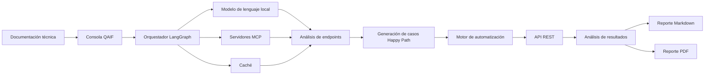

# Arquitectura del framework QAIF

## Propósito

QAIF (Quality Assurance with Artificial Intelligence for Fintech) organiza el proceso de automatización inteligente de pruebas sobre APIs REST mediante componentes desacoplados para análisis, generación, ejecución y reporte.

La arquitectura busca mantener trazabilidad entre la documentación técnica de entrada, los casos generados, la ejecución de las pruebas y las evidencias producidas.

## Vista general

## Componentes

### Consola QAIF

Punto de interacción con el usuario. Permite iniciar el análisis de un proyecto objetivo y consultar el avance del flujo.

### Orquestador

Coordina las tareas del agente, distribuye las solicitudes entre los componentes y mantiene el orden de ejecución.

### Modelo de lenguaje

Interpreta documentación técnica, apoya la identificación de endpoints y participa en la generación asistida de casos de prueba.

### Servidores MCP

Proporcionan capacidades especializadas al flujo del agente y permiten integrar herramientas y fuentes de información.

### Caché

Reduce procesamiento repetido y conserva información temporal requerida durante el análisis.

### Generador de casos de prueba

Estructura escenarios Happy Path con datos de entrada, método HTTP, endpoint, condición esperada y criterio de validación.

### Motor de automatización

Ejecuta solicitudes sobre la API objetivo y registra los resultados técnicos de cada prueba.

### Analizador de resultados

Consolida método, URL, código HTTP, tiempo de respuesta y estado PASS o FAIL.

### Generador de reportes

Produce evidencia técnica en Markdown y PDF para facilitar la revisión del proceso.

## Principios de diseño

- Modularidad.
- Trazabilidad.
- Reproducibilidad.
- Separación de responsabilidades.
- Uso de datos sintéticos y entornos controlados.
- Apoyo de IA con supervisión humana.

## Correspondencia metodológica

La arquitectura se relaciona con las fases CDIO del proyecto:

| Fase | Aplicación en QAIF |
|---|---|
| Conceive | Identificación del problema y selección tecnológica |
| Design | Definición de componentes, flujos y criterios de validación |
| Implement | Construcción e integración del prototipo funcional |
| Operate | Ejecución, medición, reporte y evaluación |
